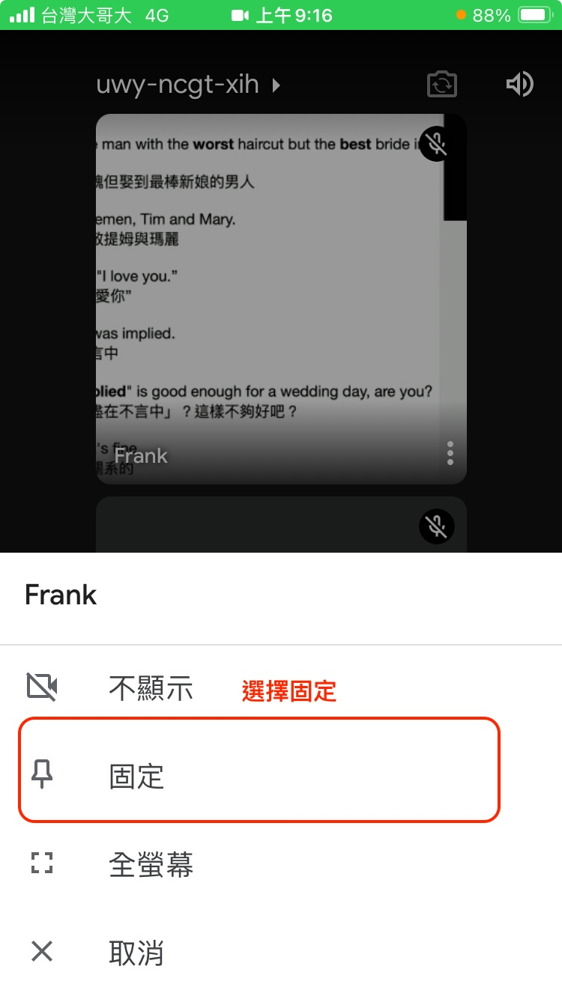
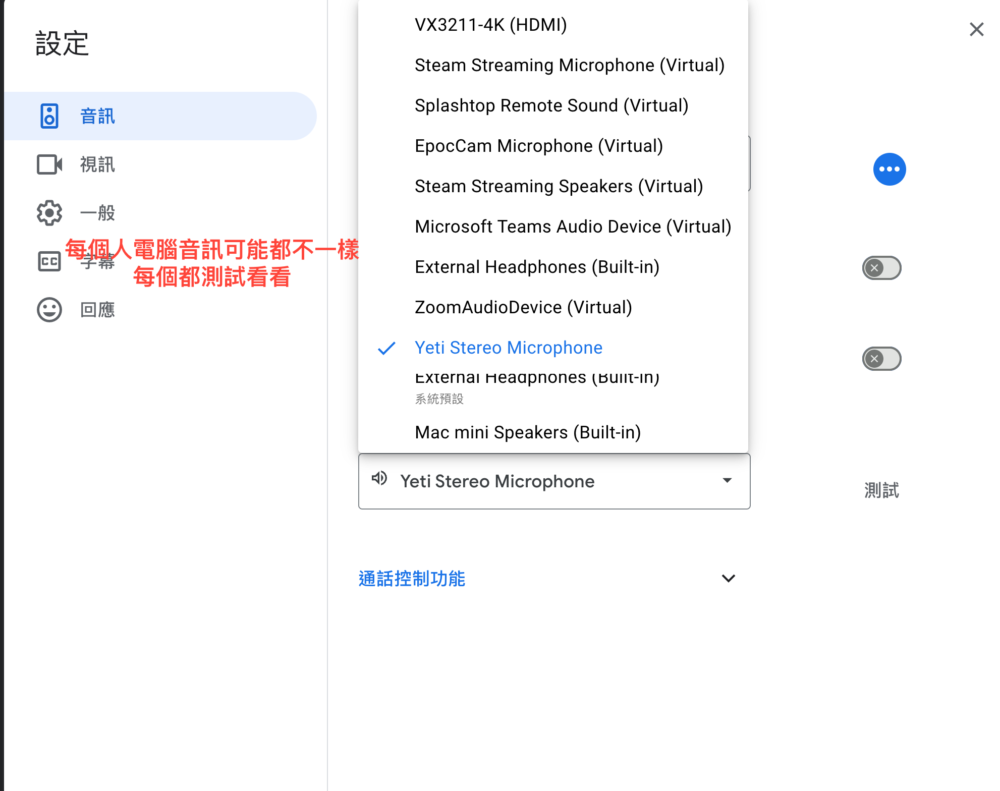

接下來直播課想嘗試用 Google Meet。我覺得不一定每個人都會用，所以寫這了篇教學，解決一些常見問題。

如果你用電腦，則直接網路瀏覽器打開 Frank 給你的連結就可以。

### (1) 手機、平板怎麼下載 Google Meet ？

如果你是用手機（希望不要，畫面真的太小）或是平板看直播課，要下載 Google Meet 的 App 會畫質和觀看體驗會比較好。

在Google Play (Android) 或是 App Store (iOS) 裡面找到 Google Meet，並下載安裝：  

[Goole Play 連結](https://play.google.com/store/apps/details?id=com.google.android.apps.tachyon&hl=zh_TW&gl=US
)   

[App Store 連結](https://apps.apple.com/tw/app/google-meet/id1096918571)

### (2) 進入會議

#### Step 1，從 Frank 寄的 Email 點連結。按 open 打開 Google Meet。進來前記得先關掉自己的聲音和畫面

---
#### 進來會議之後把 Frank 的畫面固定住

---
#### 把 Frank 的畫面設定全螢幕，把自己的畫面最小化

#### 這樣應該就看得到了

### 怎麼看聊天室？

### 聽不到聲音？
可以先在聊天室問一下是不是 Frank 忘了開。如果大家都聽到了但你沒有聽到。那就要調整自己電腦端設定。

手機、平板的音訊應該滿固定的，比較不會有聽不到聲音的問題。

電腦的話問題比較多，可以點到設定之後選擇音訊、喇叭

調整到正在使用的訊號源（你的可能不會像我的那麼多，測測看，應該會沒問題）

### 發言、舉手

這比 zoom 直觀很多（笑），按一次就好，不要一直按喔。我都會適時回應的。

各位會員有問題歡迎來信 hi@frankchi.com 或是用我的[官方帳號](https://lin.ee/0vIw5Wd)跟我說，我都會盡快回答的。

