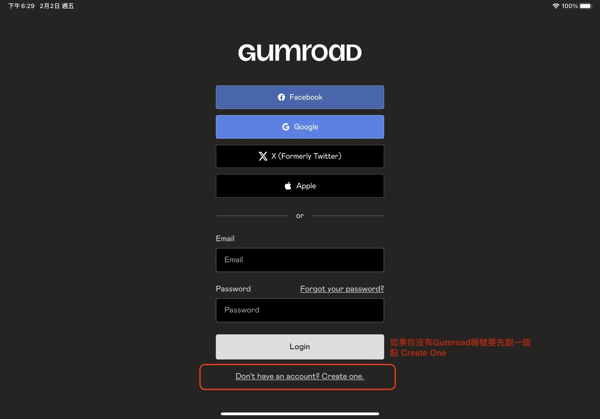
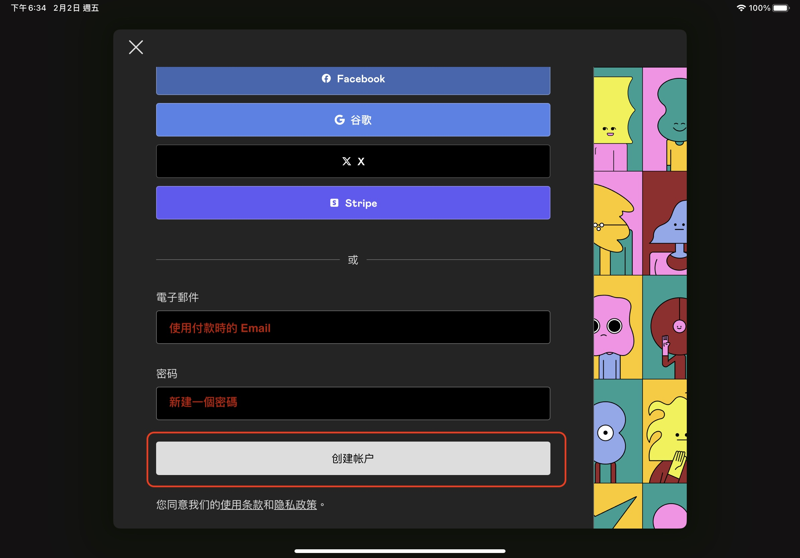
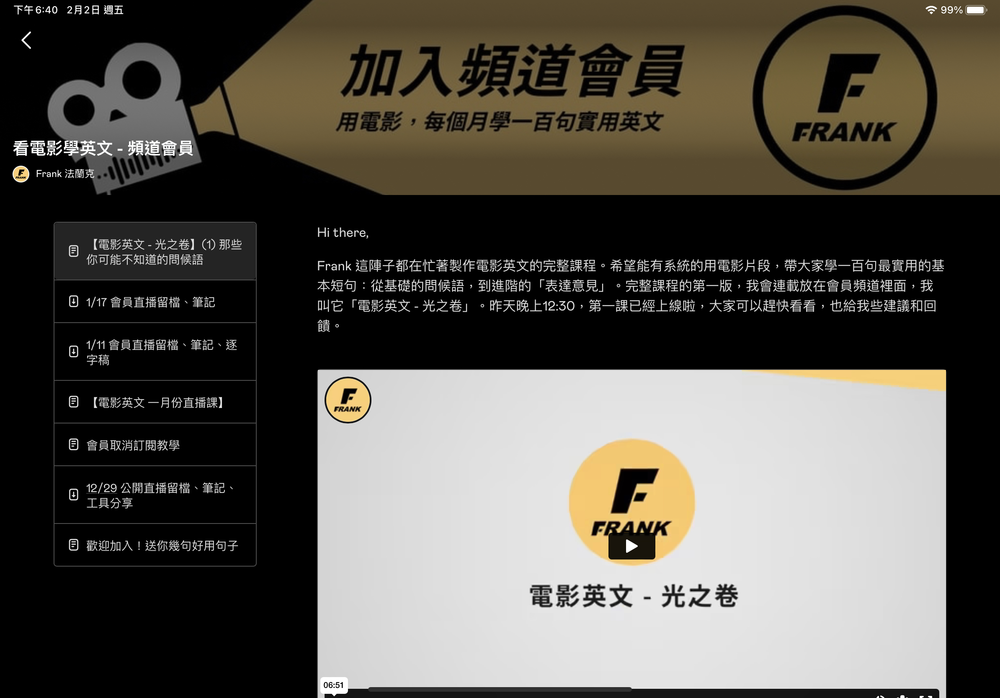

歡迎加入會員！這邊 Frank 想跟你說怎麼用平板和手機看頻道會員內容：

### 步驟一

在Google Play (連結) 或是 App Store 裡面找到 Gumroad：  
[Goole Play 連結](https://play.google.com/store/apps/details/Gumroad_Library?id=com.gumroad.app&hl=zh_TW&gl=US
)   
[App Store 連結](https://apps.apple.com/us/app/gumroad/id916819108
)

### 步驟二

下載 App 之後先不要點登入，要點登入下面的 Create one 「創造一個帳戶」

### 步驟三

請用「訂閱時用的 Email」，並創造一個你記得的密碼，然後按「創建帳戶」

### 步驟四

回到你的 Email 信箱收信。應該會有一封標題為：Confirm Instructions 「確認指示」的一封信，點擊確認電子郵件即可：

### 步驟五

回到 App 點擊 Library 就可以看到囉：

如果需要再次登入，就用Email和剛才的密碼登入即可。

### 在 iPad 上看是這樣：

想用電腦平板看嗎？教學在這邊：
[【教學】怎麼用電腦看會員頻道](/member-desktop/)

