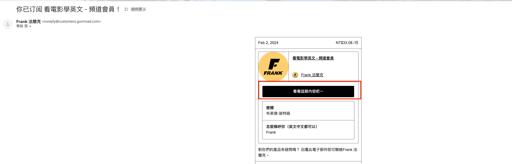

歡迎加入會員！這邊 Frank 想跟你說怎麼用電腦看頻道會員內容：

### 步驟一

前往Gumroad[連結](gumroad.com)，點擊登入。

### 步驟二

請用「訂閱時用的 Email」，創立一個新密碼。創立新帳戶：

### 步驟三

回到你的 Email 信箱收信。應該會有一封標題為：Confirm Instructions 「確認指示」的一封信，點擊確認電子郵件即可：

### 步驟五

回到網站點擊或重新整理，在Library 就可以看到囉：

你可以把這個頁面的網址（每個會員不同）設為我的最愛：

如果需要再次登入，就用Email和剛才的密碼登入即可。

### 不用創造帳號其實也可以看：

你可以去找訂閱之後系統寄給你的這封信，點擊看看這期的內容。這個方式不用創建帳號，每次只要輸入Email即可：

各位會員有問題歡迎來信 hi@frankchi.com 或是用我的[官方帳號](https://lin.ee/0vIw5Wd)跟我說，我都會盡快回答的。

**想用手機平板看嗎？來在這看教學：**
[【教學】怎麼用手機、平板看會員頻道](/member-app/)
