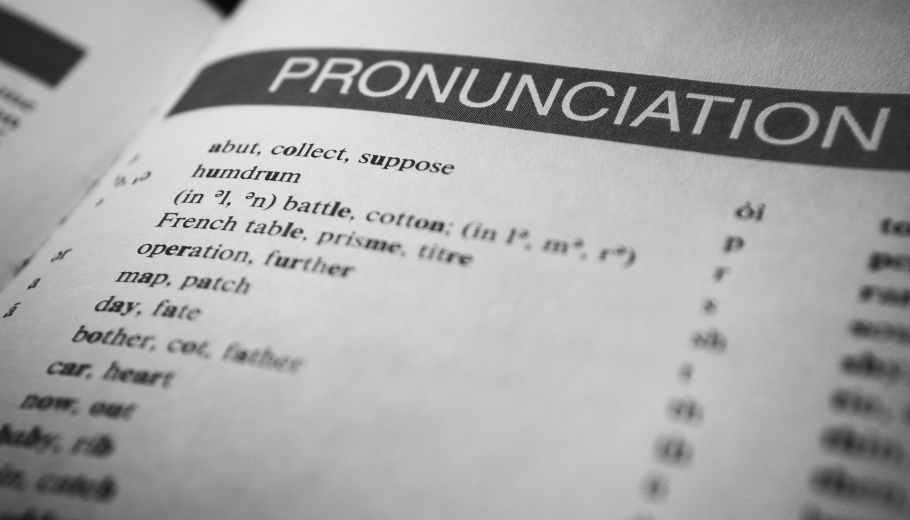

### 發音不好沒關係？為什麼我要上正音課？

> 一個外國人跑去水餃店說：
>
>**「我要去睡覺。」**
>
> 老闆回他
>
>**「要睡覺，回家去睡，這裡是吃飯的地方。」**
>
> 這個阿兜阿的意思是：「我要吃水餃。」

「我要吃水餃。」「我要去睡覺。」兩句話其實只在發音、音調上有點不同，但對理解卻會造成很大的困難。

學英文也是，沒有人希望學英文學了半天，程度很好了，發音問題還是阻礙你的表達。講了半天，發現對方根本聽不懂。更難過的，是對方根本不想聽。

很多人問發音我這樣講應該聽得懂吧？但其實很多時候就是聽不懂。

「髒螂好口怕」「你素誰」「你要不要「氣」高雄玩」這是我們常常覺得有趣的台灣國語

如果不掌握單字正確的「聲音」，那怎麼能期待別人說英文能聽得懂呢？「發音」對「聽力」的影響非常大。

>**發音好，聽力就好。發音好，背單字就快。**

### 發音要「好」到什麼程度？

其實每個人的標準都不一樣。有些人追求要和母語人士「一樣標準」。或讓母語人士「聽不出來」。有些人追求「英國腔」，覺得很美很好聽。這些都是很好的目標。

但其實不需要每個人都到這樣的程度。英文除了發音，還有寫作、字彙、文法、聽力等很多面向值得努力。人生除了學英文還有很多美好、值得追求的事情。講英文有些腔調，在很多時候別人也會覺得很有特色、很美。分享觀點、感動別人，語言的「內容」比「腔調」重要太多了。

所以，到底要不要正音呢？

我要給你一個標準：如果你的發音讓英文老師聽了，常常要再三確認你在講什麼。或外國人常常誤會或恍然大悟”oh you meant …”「喔...你的意思是」就代表你的發音會影響溝通，就需要「正音」”Accent Training”。

另一個標準：如果你常常覺得因為發音不好，不敢講英文。那就代表你對你的發音「沒自信」。讓自己發音變好、敢講、敢說、有自信，語言能力才會更快進步。這也是加強發音的很大理由。

如果你是有一定程度的英語學習者。學習碰到瓶頸，覺得自己進步很慢。你可以試試看，把學習重點放在發音上，你會發現，又開始進步了。

   

### 「正音」”Accent Training” 是什麼？

很多人覺得「正音」就在學音標。但音標只佔其中一部分。
很多人覺得「正音」在學單字的念法。只會念單字，你

**我認為正音課應該包含三大部分： 發音 + 音調 + 連音**

很多學生跟我說，我每個字都會念。但念句子還是卡卡的。聲音很怪。怎麼樣才能念的順暢，又好理解呢？你缺的就是「音調」和「連音」的練習。

以中文「我要吃水餃」講成「我要去睡覺」的這個例子來說。「吃」念錯成「去」這是「發音」”pronunciation”的問題。

水餃和睡覺，發音一樣，但是中文一二三四聲音的「音調」念錯。這就是「音調」”intonation”的問題。
最後「這樣很好」念的很快變成「醬很好」。「那樣不錯」念得很快變成「釀不錯」，這是連音的部分。

念念看”You can go.”和”You can’t go.” 
如果你的聲音念的差不多。或很用力的念can’t的t。你需要上正音課。

念念看“Betty had a bitter better butter.”
如果你沒辨法在一秒內念完，念得很卡，你需要上正音課。
