看電影學英文要有逐字稿。

逐字稿跟字幕有差嗎？

有的。

字幕在螢幕上，一閃就過。逐字稿存起來或印出來，可以讓你看到實際上的文字，會讓你學習更有效果，更能搜尋、筆記、存檔、印出來閱讀。

今天這篇會員專屬教學，想教你怎麼做出像我上課發的逐字稿。有了這樣教材，你可以更好的學習、做筆記。你也可以有更多資源做跟讀練習。想用哪部電影就用哪部電影，都會有逐字稿，我們開始吧！

製作流程稍微繁瑣，不過我覺得大家是有能力做得出來的。所以寫了這篇比較詳細的教學文，有問題歡迎問我。

### 1. 找到字幕檔
首先你需要去找這部電影或美劇的字幕檔。

我滿推薦[射手網](https://assrt.net/)，這個網站有非常多雙語字幕檔，都是免費的。

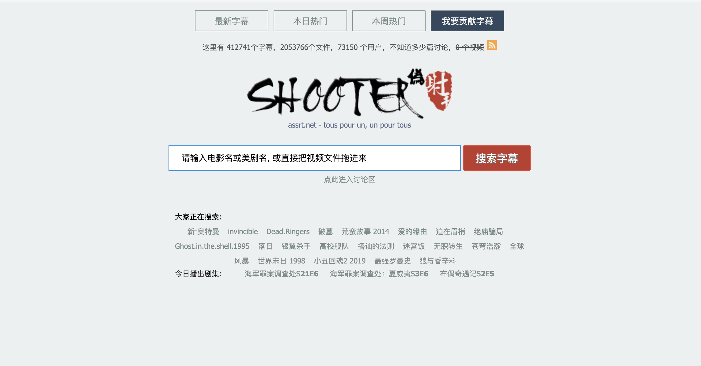

你可以直接搜尋大部分的美劇和電影。

用 Season （季）或是 Episode （集）這個兩個關鍵字來搜尋想看的影集和集數。比如說第一季第五集就是 Season 1 Episode 5。有時候則會用 S01E05 這樣的縮寫來命名。如果只有 S01 就是整個第一季的字幕。

比如說我要找 追愛總動員 How I Met Your Mother 這部影集的第一季好了，我就會用 How I Met Your Mother S01 這樣的關鍵字去搜尋。

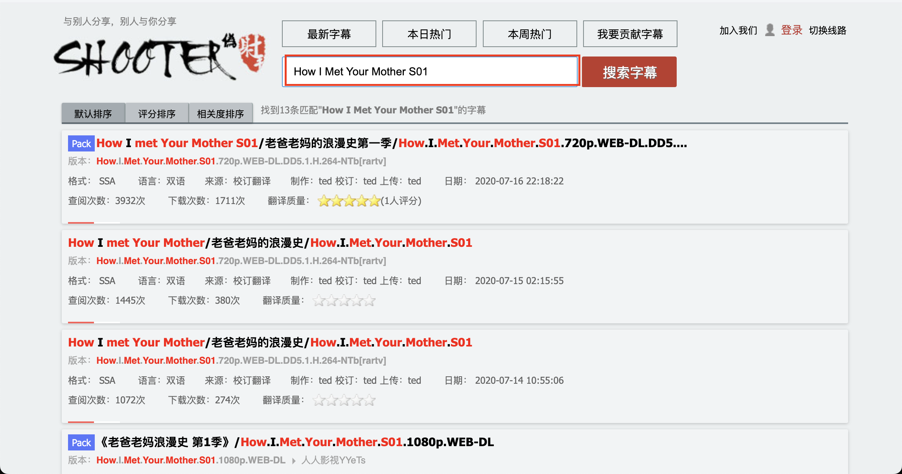

網路上的字幕檔大概分幾種，.srt 檔、 .sub 檔或是 .SSA檔。我建議你選擇 .srt 的檔案。

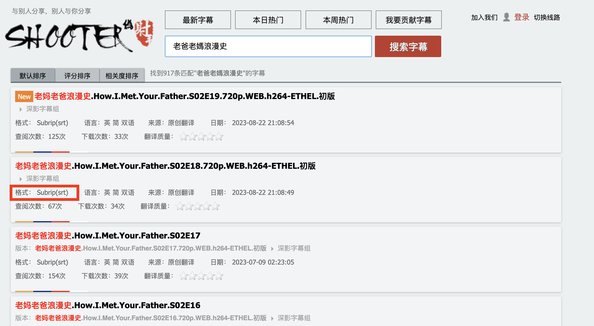

字幕請選擇：「繁英」、「簡英」、「雙語」等關鍵字。如果只有「繁」或「簡」，那就只有中文字幕。

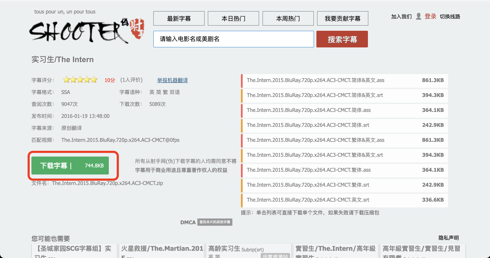

電影通常沒有集數，只有年份，兩岸港台片名翻譯差異大，你可以用英文 + 年份搜尋。高年級實習生，我就會用 The Intern (2015) 去搜尋

下載下來很多檔案。你可以觀察一下結尾的關鍵字。要選 .srt 檔名的。

cht&eng 是繁體中文和英文的雙語字幕，chs&eng 則是簡中和英文的雙語字幕。

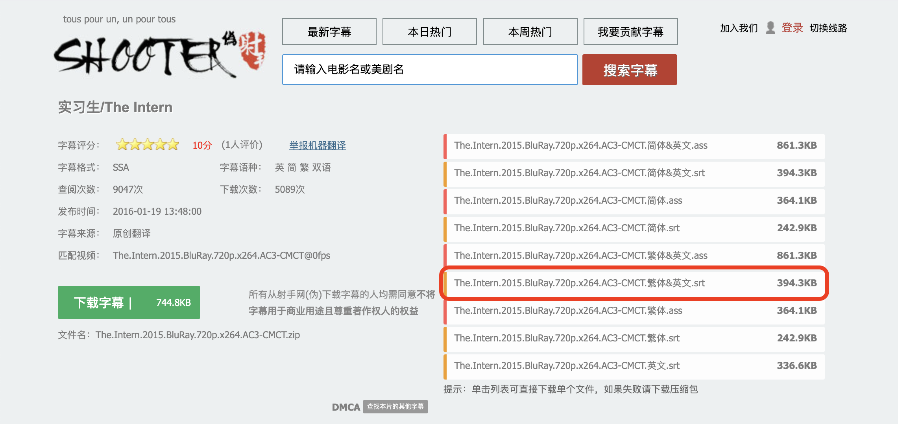

### 2. Aegisub 

下載好字幕檔之後，你需要使用 [Aegisub](https://aegisub.org/) 這個軟體，這是一個字幕工作者（字幕組）常用的軟體工具，它可以幫你把字幕檔輸出成純文字檔。

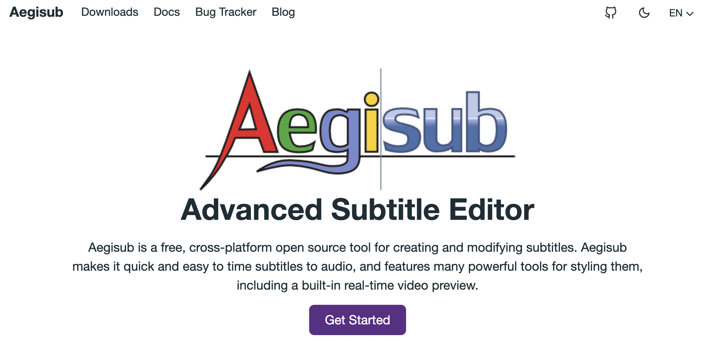

看你是用 Windows 或是 Mac 的電腦。在這個[網址](https://aegisub.org/downloads/)找到你的電腦專用的安裝檔。

打開之後選擇 Open Subtitles 開啟字幕，把剛才下載的字幕打開。

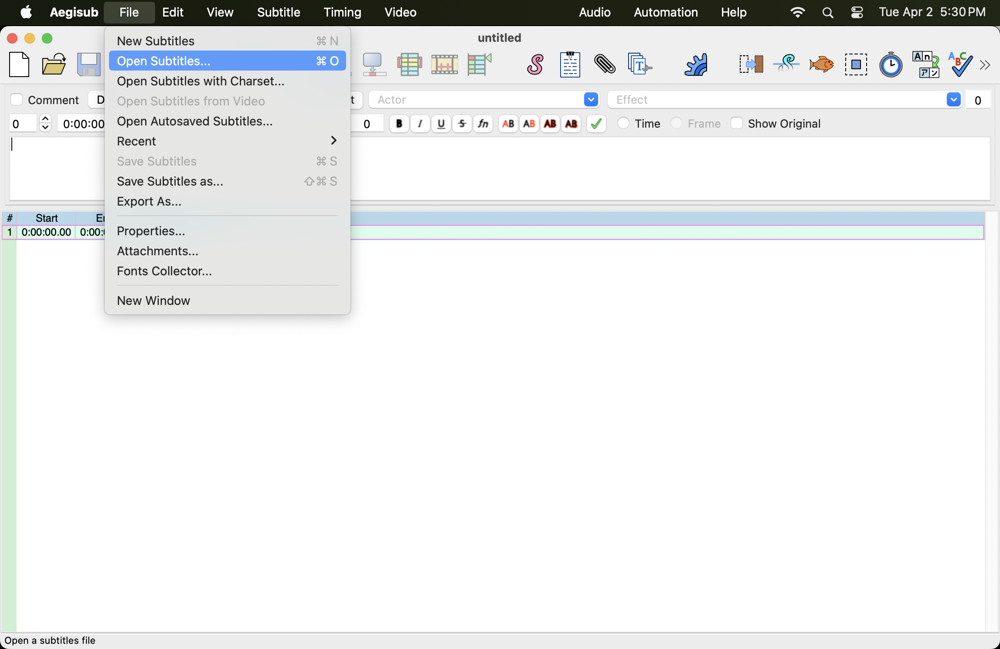

開啟字幕檔之後，你可以 Export as 輸出。

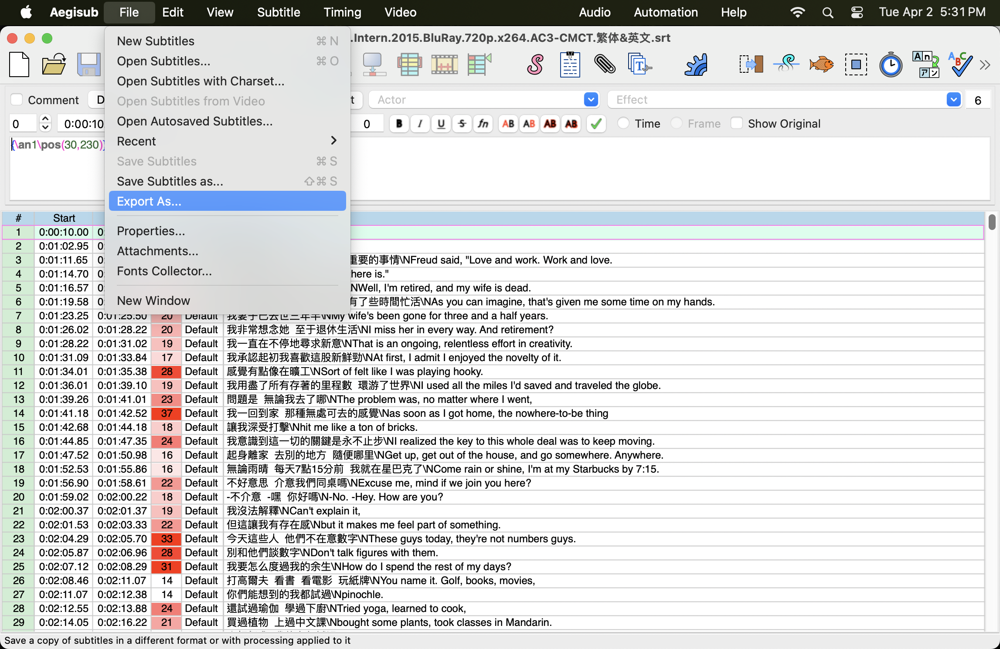

輸出時有幾個選項要注意：

Clean Tag 會把字幕檔自帶的時間軸給去掉，為了讓版面清楚，我通常都是去掉的。

Unicode 很多字幕檔案編碼不太一樣，建議你繁體簡體檔案一律選擇 Unicode (萬國碼）

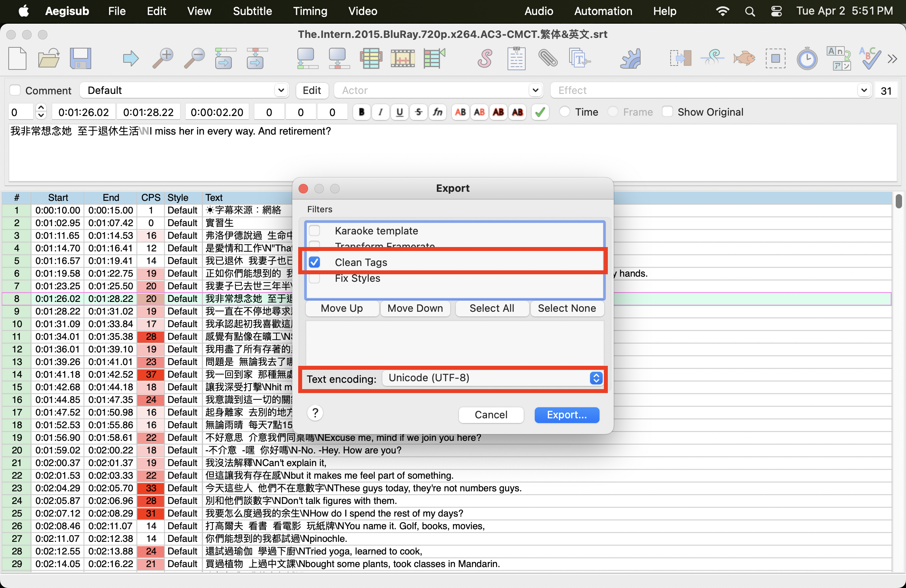

**輸出的格式記得選擇 .txt  文字檔**

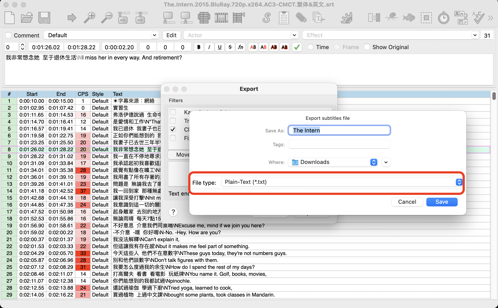

這樣的檔案輸出之後用 Word 或一般的文字處理器打開，其實就可以用了。只是很醜，沒有斷行，中文英文在同一行。所以我通常會再加工整理一下

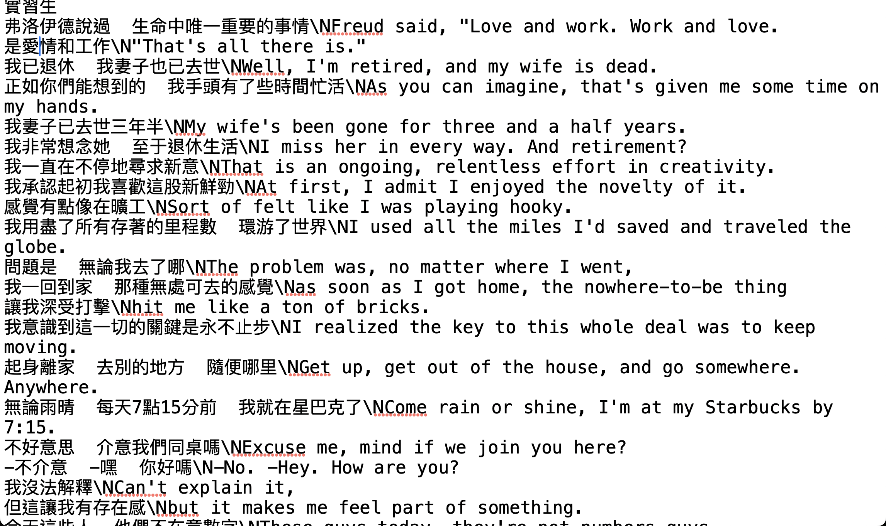

### 3. Sublime Text 

有了文字檔之後，接下來我們需要整理一下。如果你覺得繁體或簡體看不習慣，你可以複製全文之後到[這個網站](https://opencc.byvoid.com/)轉成繁體或簡體中文，再貼回去。

要調整中英文順序和斷行這邊我們要下載 [Sublime Text](https://www.sublimetext.com/)這個文字編輯器。這個軟體的幾個功能很好用。

到這個頁面安裝你的作業系統的版本。

安裝後打開Sublime Text  然後開啟剛才 Aegisub 輸出的文字檔（檔名.txt) 

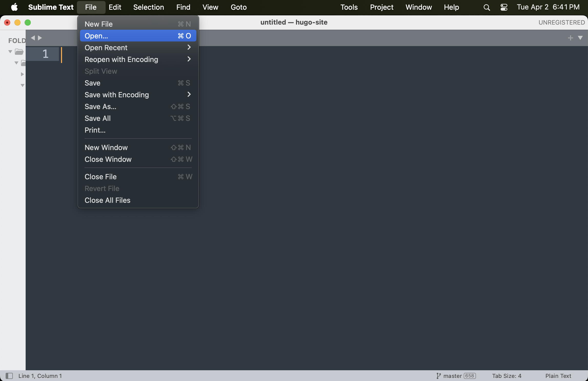

### 英文在上面的逐字稿做法

這樣的內容是沒有斷行的，很醜，這邊想教你怎麼樣把它整理得漂亮一點。

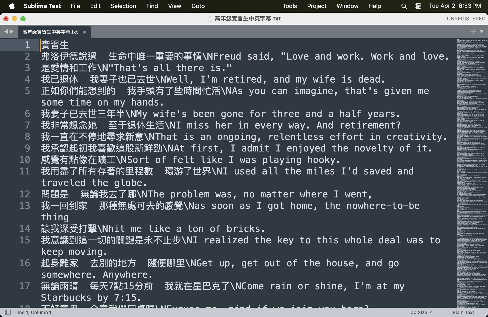

如果你想要英文在上面，中文在下。我幾年前也研究出了不寫程式做到的方式，只是比較繁瑣，請確實按照步驟做：

1. 在 Sublime Text 上方選單選擇 Edit (編輯) -> Permute Lines (排列行) -> Reverse (翻轉)

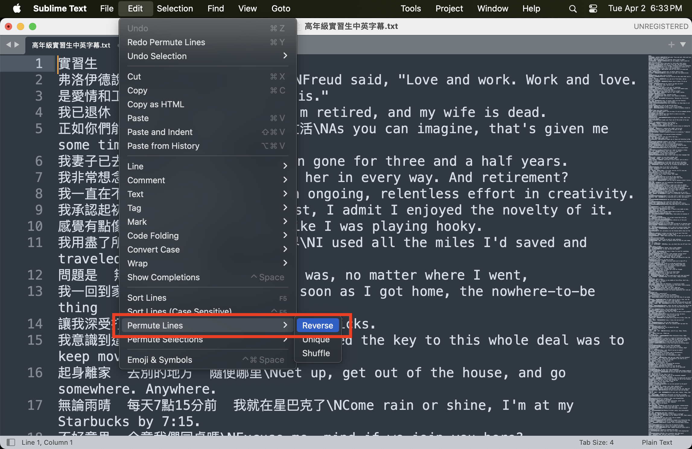

這樣每行的順序都會倒過來。

2. 在選單中選擇 Find （尋找） -> Replace （取代）

左邊有一個 .* (Regular Expression) 記得勾選之後搜尋：

>> Find 的部份我們打這個：
>> **$\n**  
>> Replace 的部分我們用兩個斷行符號：
>> **\n\n**

這樣就有斷行了，是不是清楚很多？

3. 中英文字的斷行

接下來我們要再做第二次尋找取代，一樣要記得勾選左邊 .* 的符號

>> Find 這次我們打這個：
>> **\\\n**  
>> Replace 的部分我們用一個斷行符號：
>> **\n**

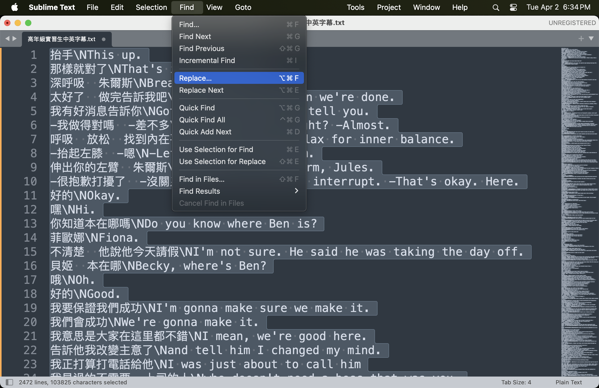

這樣中英文也斷行了，是不是很接近了？

4. 倒反所有文字順序

最後再回到 Edit (編輯) -> Permute Lines (排列行) -> Reverse (翻轉) 把每一行順序倒回來。

這樣就完成囉，你可以貼到 Word，就是完整、清楚的逐字稿了。

如果你不在乎中文在上還是英文在上，那你可以跳過 1 和 4 步。

