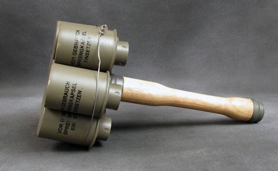
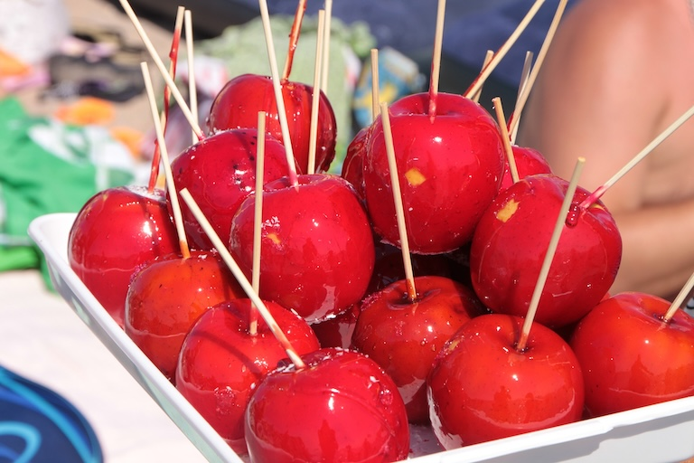



**當別人用英文問你喜不喜歡蘋果，你知道，他其實在嗆你嗎？**

>> **How do you like them apples?**   
>> 你喜不喜歡這些蘋果

這句話其實和，Do you like apples? 不一樣。

是吵架、比賽贏了之後用來示威嗆人的一句垃圾話。有點「怎樣？如何？爽不爽啦？」的感覺。

為什麼是蘋果呢？

 

一戰時候的反坦克手榴彈，看起來很像美國的一種甜點、太妃蘋果 toffee apple 。

所以這句就有丟完手榴彈問對方喜不喜歡蘋果的感覺。

多年前看 Matt Damon 在「心靈捕手」裡面講這句，我那時就很困惑為什麼問對方喜不喜歡蘋果。原來是嗆人的話，跟手榴彈有關係。

這句台詞成為他在好萊塢的註冊商標，連頒獎上台都拿顆蘋果，超好笑的。

With Footage From:  
🎥 心靈捕手（Good Will Hunting)  
🎥 黑道家族 (The Sopranos)  
🎥 好想做一次（Never Have I Ever)   
🎥 伴郎友沒友(The Wedding Ringer)   
🎥 廣播室愛情 (NewsRadio)   
🎥 荒唐分局（Brooklyn Nine-Nine)  
🎥 Matt Damon Confronts Jimmy Kimmel After Emmys Loss  
🎥 議員拿「芭樂」模擬手榴彈 侯友宜：反對警察軍事化  