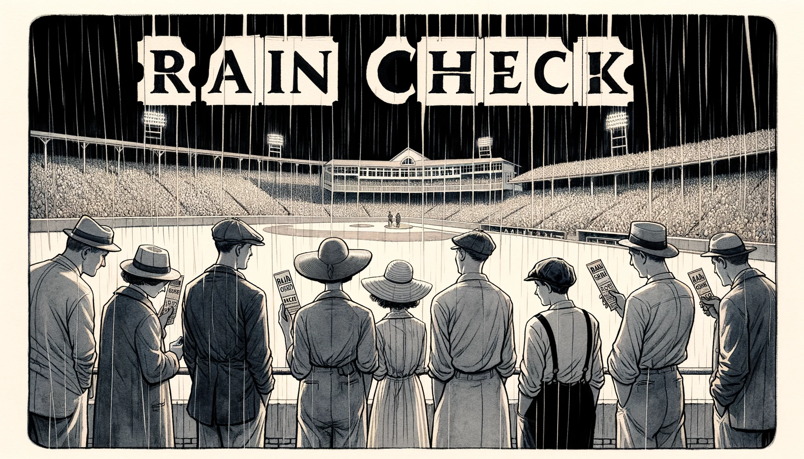



當別人邀請你出去，你沒空或不想去，你會怎麼拒絕呢？

今天我們學一句棒球英文：

#### Take a rain check 

就是「改天吧」

這裡的 rain check 不是檢查有沒有下雨。

以前的棒球比賽，下雨天停賽的時候，球場給你一張rain check 「雨票」，下次沒下雨再來看球。

後來就衍伸成「改天」或「改天再約」的意思。

你可以說：

>> **I am sorry. I can't. Can I take a rain check?**    
>> 抱歉我今天無法。可以改天嗎？

再禮貌一點，你可以說：

>> **I wish I could. Do you mind if I take a rain check?**  
>> 你會介意我改天嗎？

如果真的忘記了，你當然還是可以用 **Maybe next time.** 

下次試試看吧～ 



With Footage From:    
🎥 王牌天神 (Bruce Almighty)    
🎥 六人行(Friends)  
🎥 欲望師奶(Desperate Housewives)  
