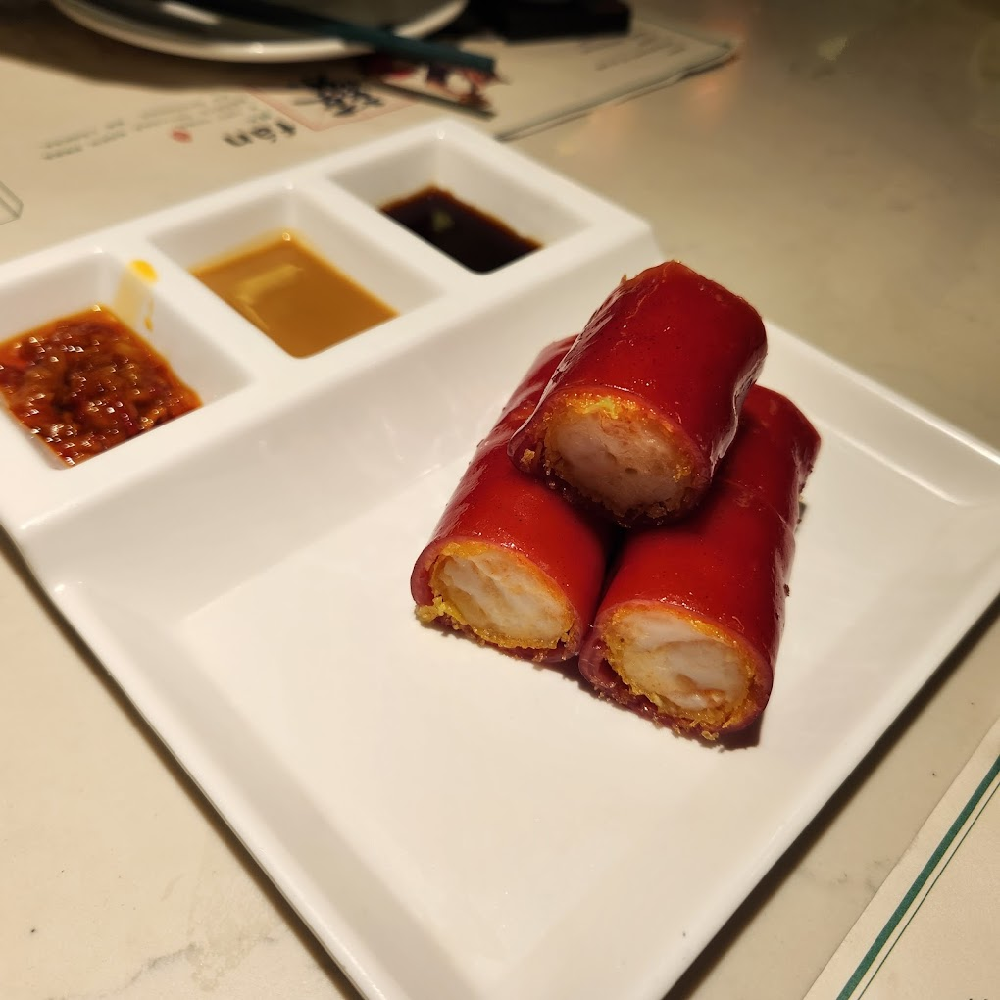
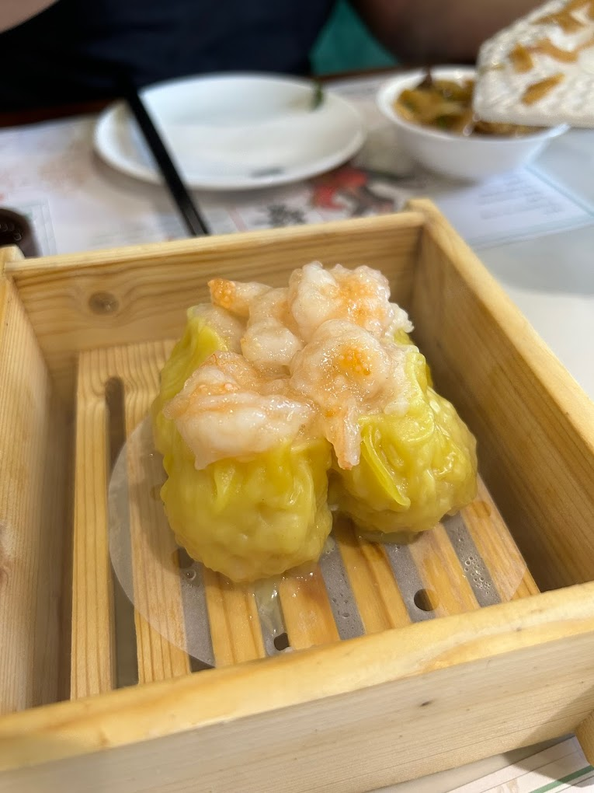
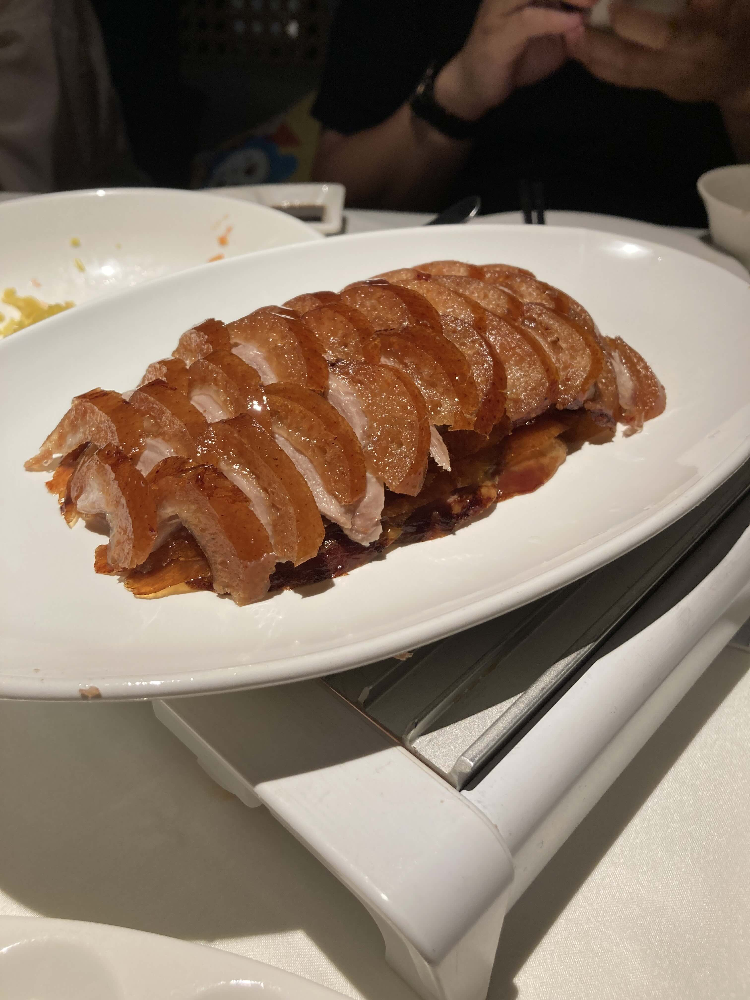
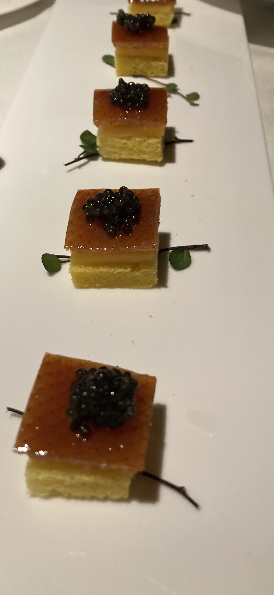

這次陪朋友參加商展，也來看看大陸、開開眼界。我們跑了五個一、二線城市：上海、寧波、義烏、深圳、廣州。真的有 jaw-dropped （下巴掉下來）的感覺。

撇開政治不談，這裡一線城市不但人多地方大，建設真的很進步。成群大樓高聳入雲、電動車滿街跑；外賣半夜送到旅館房門口，智能機器人在旅館和餐廳跑來跑去；每一款 APP 都好用，生活大小事一隻手機搞定。十年沒來深圳，變化特別大。

吃的更不得了。想跟大家推薦深圳這家[「蘩樓」](https://hk.trip.com/moments/detail/shenzhen-26-119303950/)餐廳。這是我吃過「早茶」「廣式點心」的天花板（以前覺的添好運就很好吃了...）我真心沒吃過這麼美味、平價的燒賣和點心。燒賣咬一下去，滿滿兩三隻鮮蝦在嘴巴裡跳的感覺，我到現在還記得。It’s really out of this world. （人間美味）。明蝦紅米腸也很推薦，酥脆外皮裹著蝦子餡，我多點了一大盤。

英文我會這樣說：

>> **This place ruined Tim Ho Wan for me.**     
>> 這家把我心中的添好運毀了。

代表這個餐廳超越之前的體驗，把我心中的第一：添好運，毀了，不會想再去吃的。是一句很可以學的讚美。

另外一家烤鴨店[「京炙坊」](https://hk.trip.com/travel-guide/foods/shenzhen-26-restaurant/jingzhifang-57318384)則是我吃過最優秀的烤鴨。烤鴨的脆皮放在起司和酥脆餅乾，上面再點上魚子醬！ So exquistie (精緻) 吃烤鴨最討厭的的就是麵皮常常會黏在一起。可能是我沒見過世面，這裡麵皮麵皮之間都是有烘焙紙分隔的，超好撕。

其他餐點不管是松鼠魚、烤羊肉夾饃，都很讚。「京炙坊」比台灣的幾家烤鴨名店（龍都、宋廚、蘭城晶英）都厲害，但是價格只要一半。

結帳的時候店家還問我們要不要儲值三千，可以整單免費！這麼好吃不貴的餐廳在台北應該是會排到翻掉，躺著賺。但在這裡還是要很努力的促銷，因為好餐廳太多了。我想這就是他們說「很卷」的意思。	

土生土長在台灣，一直都不是很想、也有點抗拒去大陸。這次很開心有來看看。雖然什麼都要實名制、上網翻牆很麻煩，我覺得是很值得的。

2024 
記於深圳  
Frank 

